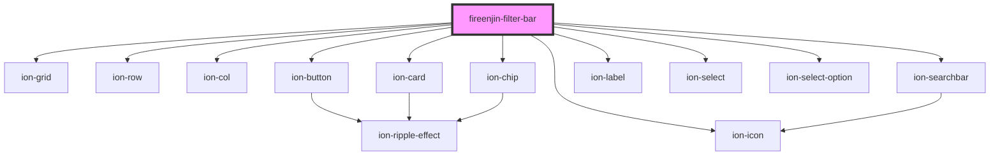

# fireenjin-filter-bar

<!-- Auto Generated Below -->

## Properties

| Property       | Attribute       | Description | Type                                                                                                                                       | Default     |
| -------------- | --------------- | ----------- | ------------------------------------------------------------------------------------------------------------------------------------------ | ----------- |
| `filter`       | --              |             | `{ label?: string; controls: Control[]; }`                                                                                                 | `undefined` |
| `modeToggle`   | `mode-toggle`   |             | `boolean`                                                                                                                                  | `false`     |
| `paginationEl` | `pagination-el` |             | `any`                                                                                                                                      | `undefined` |
| `sort`         | --              |             | `{ label?: string; value?: string; header?: string; subHeader?: string; message?: string; options: { label: string; value: string; }[]; }` | `undefined` |

## Methods

### `clearFilter(event: any, clearingControl: Control) => Promise<void>`

#### Returns

Type: `Promise<void>`

### `openFilterPopover(event: any) => Promise<void>`

#### Returns

Type: `Promise<void>`

### `togglePaginationDisplay() => Promise<void>`

#### Returns

Type: `Promise<void>`

## Dependencies

### Depends on

- ion-grid
- ion-row
- ion-col
- ion-button
- ion-icon
- ion-searchbar
- ion-card
- ion-chip
- ion-label
- ion-select
- ion-select-option

### Graph

----------------------------------------------

*Built with [StencilJS](https://stenciljs.com/)*
