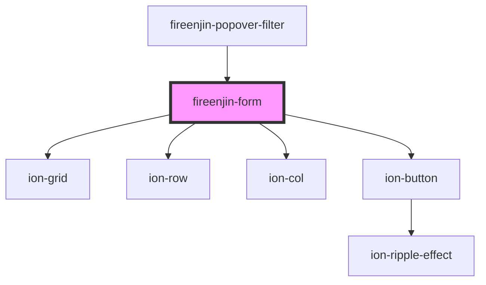

# fireenjin-form

<!-- Auto Generated Below -->

## Properties

| Property             | Attribute              | Description                                                            | Type                                           | Default     |
| -------------------- | ---------------------- | ---------------------------------------------------------------------- | ---------------------------------------------- | ----------- |
| `action`             | `action`               | The action to use for the form                                         | `string`                                       | `undefined` |
| `apiUrl`             | `api-url`              |                                                                        | `string`                                       | `undefined` |
| `beforeSubmit`       | --                     | A method that runs before form submission to allow editing of formData | `(data: any, options?: any) => Promise<any>`   | `undefined` |
| `confirmExit`        | `confirm-exit`         | Confirm leaving the page when the form is filled                       | `boolean`                                      | `false`     |
| `disableEnterButton` | `disable-enter-button` | Should the enter button binding be disabled                            | `boolean`                                      | `false`     |
| `disableLoader`      | `disable-loader`       | Should the form disable the loader on submit                           | `boolean`                                      | `false`     |
| `disableReset`       | `disable-reset`        | Should the form disable reset                                          | `boolean`                                      | `false`     |
| `documentId`         | `document-id`          | The id of the document being edited                                    | `string`                                       | `undefined` |
| `endpoint`           | `endpoint`             | The endpoint that form submission should link to                       | `string`                                       | `undefined` |
| `excludeData`        | --                     | The data to exclude from the form submit event                         | `string[]`                                     | `[]`        |
| `findDataMap`        | `find-data-map`        | The data map to find                                                   | `any`                                          | `undefined` |
| `findEndpoint`       | `find-endpoint`        | The endpoint to get data to fill the form                              | `string`                                       | `undefined` |
| `findParams`         | `find-params`          | The form params                                                        | `any`                                          | `undefined` |
| `formData`           | `form-data`            | The data from the form being filled out                                | `any`                                          | `{}`        |
| `hasChanged`         | `has-changed`          | Has the form fields been changed                                       | `boolean`                                      | `false`     |
| `hideControls`       | `hide-controls`        | Should the form controls be hidden?                                    | `boolean`                                      | `false`     |
| `loading`            | `loading`              | Is the component currently loading                                     | `boolean`                                      | `false`     |
| `method`             | `method`               | The HTTP method to use when submitting the form                        | `string`                                       | `"post"`    |
| `name`               | `name`                 | The name of the form used for ID and name                              | `string`                                       | `undefined` |
| `resetButton`        | `reset-button`         | What the reset button says                                             | `string`                                       | `"Cancel"`  |
| `resetButtonColor`   | `reset-button-color`   | What color the reset button is                                         | `string`                                       | `"dark"`    |
| `resetButtonFill`    | `reset-button-fill`    | What fill option to use for the reset button                           | `"clear" \| "default" \| "outline" \| "solid"` | `"clear"`   |
| `submitButton`       | `submit-button`        | What the save button says                                              | `string`                                       | `"Save"`    |
| `submitButtonColor`  | `submit-button-color`  | What color the submit button is                                        | `string`                                       | `"primary"` |
| `submitButtonFill`   | `submit-button-fill`   | What fill option to use for the submit button                          | `"clear" \| "default" \| "outline" \| "solid"` | `"solid"`   |

## Events

| Event                 | Description                            | Type                                                                                  |
| --------------------- | -------------------------------------- | ------------------------------------------------------------------------------------- |
| `fireenjinFetch`      | Emitted on load with endpoint          | `CustomEvent<{ event?: any; endpoint: string; params?: any; name?: string; }>`        |
| `fireenjinReset`      | Emitted when the user resets the form  | `CustomEvent<{ event: any; id: string; endpoint: string; data: any; name: string; }>` |
| `fireenjinSubmit`     | Emitted when the user submits the form | `CustomEvent<{ event: any; id: string; endpoint: string; data: any; name: string; }>` |
| `fireenjinValidation` | Emitted when a filed checks validation | `CustomEvent<{ event: any; isValid: boolean; name: string; }>`                        |

## Methods

### `checkFormValidity(reportValidity?: boolean) => Promise<boolean>`

#### Returns

Type: `Promise<boolean>`

### `reportFormValidity() => Promise<void>`

#### Returns

Type: `Promise<void>`

### `reset(event?: any) => Promise<boolean>`

Emit fireenjinReset event with form data

#### Returns

Type: `Promise<boolean>`

### `setFormData(data: any) => Promise<void>`

#### Returns

Type: `Promise<void>`

### `setLoading(value: boolean) => Promise<void>`

#### Returns

Type: `Promise<void>`

### `submit(event?: any, options?: { manual: boolean; }) => Promise<void>`

Emit fireenjinSubmit event with form data

#### Returns

Type: `Promise<void>`

## Dependencies

### Used by

 - [fireenjin-popover-filter](../popover-filter)

### Depends on

- ion-grid
- ion-row
- ion-col
- ion-button

### Graph

----------------------------------------------

*Built with [StencilJS](https://stenciljs.com/)*
