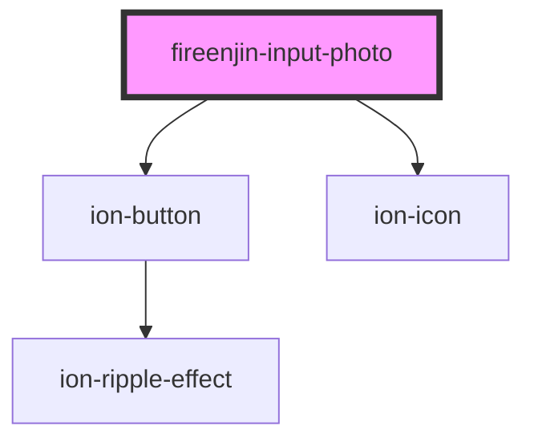

# fireenjin-input-photo

<!-- Auto Generated Below -->

## Properties

| Property     | Attribute     | Description                                      | Type      | Default        |
| ------------ | ------------- | ------------------------------------------------ | --------- | -------------- |
| `buttonText` | `button-text` | Text to display on the photo upload button       | `string`  | `"Edit Image"` |
| `disabled`   | `disabled`    | Is the uploader disabled                         | `boolean` | `false`        |
| `documentId` | `document-id` | The ID of the document the photo is tied to      | `string`  | `undefined`    |
| `endpoint`   | `endpoint`    | The endpoint to upload to                        | `string`  | `"upload"`     |
| `fallback`   | `fallback`    | The fallback image to use if photo isn't set     | `string`  | `undefined`    |
| `fileName`   | `file-name`   | The filename to use for the uploaded file        | `string`  | `undefined`    |
| `initials`   | `initials`    |                                                  | `string`  | `undefined`    |
| `loading`    | `loading`     |                                                  | `boolean` | `undefined`    |
| `multiple`   | `multiple`    | Allow uploading multiple                         | `boolean` | `false`        |
| `name`       | `name`        | The name to use when emitting field change event | `string`  | `undefined`    |
| `path`       | `path`        | The storage path to upload the file to           | `string`  | `undefined`    |
| `resize`     | `resize`      | Resize photos before uploading                   | `boolean` | `false`        |
| `showButton` | `show-button` | Should the photo uploader show the button        | `boolean` | `false`        |
| `type`       | `type`        | The type of photo being uploaded                 | `string`  | `"photo"`      |
| `value`      | `value`       | A link to the photo to display                   | `string`  | `undefined`    |

## Events

| Event             | Description | Type               |
| ----------------- | ----------- | ------------------ |
| `fireenjinUpload` |             | `CustomEvent<any>` |
| `ionInput`        |             | `CustomEvent<any>` |

## Methods

### `triggerFileInput(_event: any) => Promise<boolean>`

#### Returns

Type: `Promise<boolean>`

## Dependencies

### Depends on

- ion-button
- ion-icon

### Graph

----------------------------------------------

*Built with [StencilJS](https://stenciljs.com/)*
