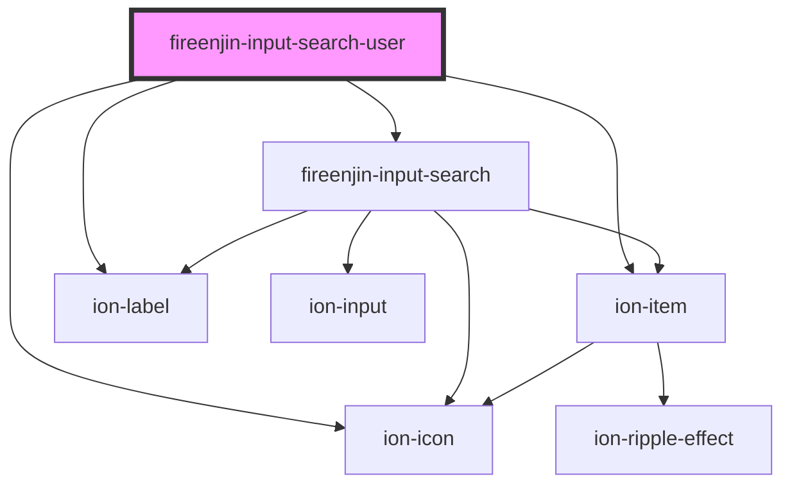

# fireenjin-input-search-user

<!-- Auto Generated Below -->

## Properties

| Property        | Attribute        | Description | Type                                 | Default          |
| --------------- | ---------------- | ----------- | ------------------------------------ | ---------------- |
| `autofocus`     | `autofocus`      |             | `boolean`                            | `undefined`      |
| `dataPropsMap`  | `data-props-map` |             | `any`                                | `undefined`      |
| `disableSearch` | `disable-search` |             | `boolean`                            | `false`          |
| `disabled`      | `disabled`       |             | `boolean`                            | `undefined`      |
| `endpoint`      | `endpoint`       |             | `string`                             | `undefined`      |
| `iconEnd`       | `icon-end`       |             | `string`                             | `undefined`      |
| `iconStart`     | `icon-start`     |             | `string`                             | `undefined`      |
| `label`         | `label`          |             | `string`                             | `undefined`      |
| `labelPosition` | `label-position` |             | `"fixed" \| "floating" \| "stacked"` | `undefined`      |
| `limit`         | `limit`          |             | `number`                             | `5`              |
| `lines`         | `lines`          |             | `"full" \| "inset" \| "none"`        | `undefined`      |
| `mode`          | `mode`           |             | `"inline" \| "popover"`              | `"inline"`       |
| `name`          | `name`           |             | `string`                             | `undefined`      |
| `placeholder`   | `placeholder`    |             | `string`                             | `"Search Users"` |
| `required`      | `required`       |             | `boolean`                            | `undefined`      |
| `results`       | --               |             | `any[]`                              | `[]`             |
| `template`      | --               |             | `(result: any) => any`               | `undefined`      |
| `value`         | `value`          |             | `any`                                | `undefined`      |

## Events

| Event                 | Description | Type               |
| --------------------- | ----------- | ------------------ |
| `fireenjinSelectUser` |             | `CustomEvent<any>` |
| `ionInput`            |             | `CustomEvent<any>` |

## Dependencies

### Depends on

- [fireenjin-input-search](../input-search)
- ion-item
- ion-label
- ion-icon

### Graph

----------------------------------------------

*Built with [StencilJS](https://stenciljs.com/)*
