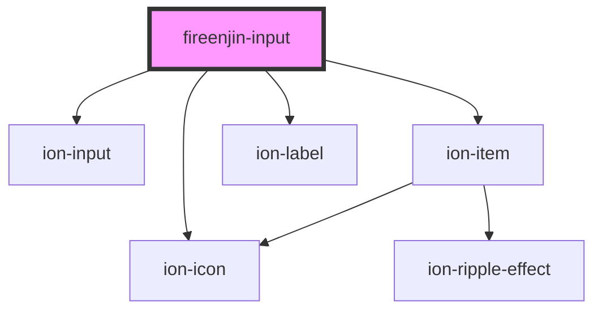

# fireenjin-input

<!-- Auto Generated Below -->

## Properties

| Property         | Attribute        | Description | Type                                 | Default     |
| ---------------- | ---------------- | ----------- | ------------------------------------ | ----------- |
| `actionOptions`  | `action-options` |             | `any`                                | `undefined` |
| `autocapitalize` | `autocapitalize` |             | `string`                             | `undefined` |
| `autocomplete`   | `autocomplete`   |             | `"off" \| "on"`                      | `"off"`     |
| `autocorrect`    | `autocorrect`    |             | `"off" \| "on"`                      | `undefined` |
| `autofocus`      | `autofocus`      |             | `boolean`                            | `undefined` |
| `clearInput`     | `clear-input`    |             | `boolean`                            | `false`     |
| `disabled`       | `disabled`       |             | `boolean`                            | `undefined` |
| `edit`           | `edit`           |             | `boolean`                            | `undefined` |
| `iconLeft`       | `icon-left`      |             | `string`                             | `undefined` |
| `iconRight`      | `icon-right`     |             | `string`                             | `undefined` |
| `info`           | `info`           |             | `string`                             | `undefined` |
| `inputMode`      | `input-mode`     |             | `string`                             | `"text"`    |
| `label`          | `label`          |             | `string`                             | `undefined` |
| `labelPosition`  | `label-position` |             | `"fixed" \| "floating" \| "stacked"` | `undefined` |
| `lines`          | `lines`          |             | `"full" \| "inset" \| "none"`        | `undefined` |
| `max`            | `max`            |             | `string`                             | `undefined` |
| `maxlength`      | `maxlength`      |             | `number`                             | `undefined` |
| `min`            | `min`            |             | `string`                             | `undefined` |
| `minlength`      | `minlength`      |             | `number`                             | `undefined` |
| `multiple`       | `multiple`       |             | `boolean`                            | `false`     |
| `name`           | `name`           |             | `string`                             | `undefined` |
| `pattern`        | `pattern`        |             | `any`                                | `undefined` |
| `placeholder`    | `placeholder`    |             | `any`                                | `undefined` |
| `readOnly`       | `read-only`      |             | `boolean`                            | `false`     |
| `required`       | `required`       |             | `any`                                | `undefined` |
| `silence`        | `silence`        |             | `boolean`                            | `undefined` |
| `spellCheck`     | `spell-check`    |             | `boolean`                            | `false`     |
| `step`           | `step`           |             | `string`                             | `undefined` |
| `stripeElements` | --               |             | `{ style?: any; fonts?: any[]; }`    | `{}`        |
| `stripeKey`      | `stripe-key`     |             | `string`                             | `undefined` |
| `type`           | `type`           |             | `any`                                | `undefined` |
| `value`          | `value`          |             | `any`                                | `undefined` |

## Events

| Event       | Description | Type               |
| ----------- | ----------- | ------------------ |
| `ionBlur`   |             | `CustomEvent<any>` |
| `ionChange` |             | `CustomEvent<any>` |
| `ionFocus`  |             | `CustomEvent<any>` |
| `ionInput`  |             | `CustomEvent<any>` |

## Methods

### `checkValidity(options?: { setValidationClass?: boolean; validationClassOptions?: { ignoreInvalid?: boolean; }; }) => Promise<boolean>`

#### Returns

Type: `Promise<boolean>`

### `clear() => Promise<void>`

#### Returns

Type: `Promise<void>`

### `getCardToken(options?: { name?: string; address_line1?: string; address_line2?: string; address_city?: string; address_state?: string; address_zip?: string; address_country?: string; currency?: string; }) => Promise<any>`

#### Returns

Type: `Promise<any>`

### `reportValidity() => Promise<boolean>`

#### Returns

Type: `Promise<boolean>`

### `setFocus() => Promise<void>`

#### Returns

Type: `Promise<void>`

## Dependencies

### Depends on

- ion-input
- ion-item
- ion-icon
- ion-label

### Graph

----------------------------------------------

*Built with [StencilJS](https://stenciljs.com/)*
