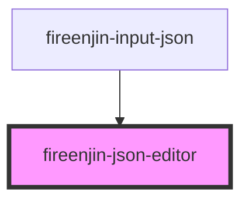

# fireenjin-json-editor

<!-- Auto Generated Below -->

## Properties

| Property        | Attribute        | Description | Type                                                              | Default            |
| --------------- | ---------------- | ----------- | ----------------------------------------------------------------- | ------------------ |
| `editorOptions` | `editor-options` |             | `any`                                                             | `{}`               |
| `label`         | `label`          |             | `string`                                                          | `undefined`        |
| `mode`          | `mode`           |             | `"code" \| "tree"`                                                | `"tree"`           |
| `modes`         | --               |             | `("text" \| "tree" \| "code" \| "form" \| "view" \| "preview")[]` | `["tree", "code"]` |
| `name`          | `name`           |             | `string`                                                          | `"json"`           |
| `value`         | `value`          |             | `any`                                                             | `undefined`        |

## Events

| Event       | Description | Type               |
| ----------- | ----------- | ------------------ |
| `ionChange` |             | `CustomEvent<any>` |
| `ionInput`  |             | `CustomEvent<any>` |

## Methods

### `get() => Promise<any>`

#### Returns

Type: `Promise<any>`

### `set(value: any) => Promise<void>`

#### Returns

Type: `Promise<void>`

## Dependencies

### Used by

 - [fireenjin-input-json](../input-json)

### Graph

----------------------------------------------

*Built with [StencilJS](https://stenciljs.com/)*
