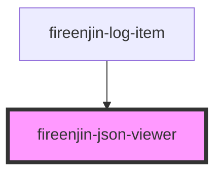

# fireenjin-json-viewer

<!-- Auto Generated Below -->

## Properties

| Property    | Attribute    | Description | Type      | Default |
| ----------- | ------------ | ----------- | --------- | ------- |
| `openDepth` | `open-depth` |             | `number`  | `1`     |
| `watcher`   | `watcher`    |             | `boolean` | `false` |

## Methods

### `formatStringJSON(str: string) => Promise<void>`

#### Returns

Type: `Promise<void>`

## Dependencies

### Used by

 - [fireenjin-log-item](../log-item)

### Graph

----------------------------------------------

*Built with [StencilJS](https://stenciljs.com/)*
