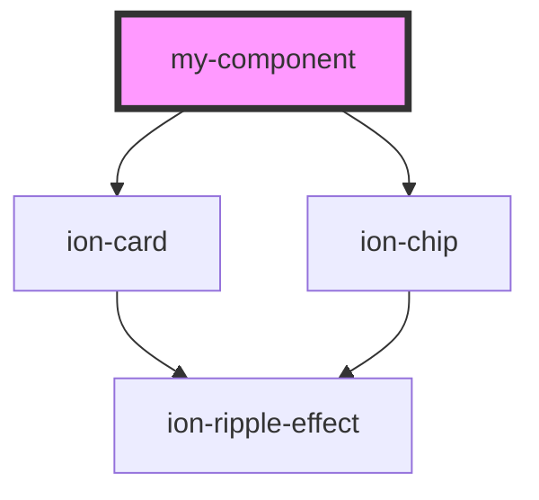

# my-component

<!-- Auto Generated Below -->

## Properties

| Property   | Attribute  | Description | Type     | Default     |
| ---------- | ---------- | ----------- | -------- | ----------- |
| `first`    | `first`    |             | `string` | `undefined` |
| `last`     | `last`     |             | `string` | `undefined` |
| `middle`   | `middle`   |             | `string` | `undefined` |
| `modifier` | `modifier` |             | `string` | `''`        |

## Events

| Event     | Description | Type                |
| --------- | ----------- | ------------------- |
| `clicked` |             | `CustomEvent<void>` |

## Dependencies

### Depends on

- ion-card
- ion-chip

### Graph

----------------------------------------------

*Built with [StencilJS](https://stenciljs.com/)*
