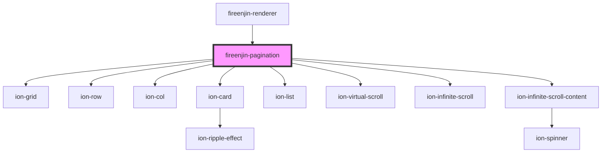

# fireenjin-pagination

<!-- Auto Generated Below -->

## Properties

| Property               | Attribute                | Description | Type                            | Default                  |
| ---------------------- | ------------------------ | ----------- | ------------------------------- | ------------------------ |
| `approxItemHeight`     | `approx-item-height`     |             | `number`                        | `undefined`              |
| `collection`           | `collection`             |             | `string`                        | `undefined`              |
| `dataPropsMap`         | `data-props-map`         |             | `any`                           | `undefined`              |
| `disableFetch`         | `disable-fetch`          |             | `boolean`                       | `false`                  |
| `disablePageCheck`     | `disable-page-check`     |             | `boolean`                       | `false`                  |
| `disableVirtualScroll` | `disable-virtual-scroll` |             | `boolean`                       | `false`                  |
| `display`              | `display`                |             | `"grid" \| "list"`              | `"grid"`                 |
| `endpoint`             | `endpoint`               |             | `string`                        | `undefined`              |
| `fetchData`            | `fetch-data`             |             | `any`                           | `undefined`              |
| `fetchParams`          | `fetch-params`           |             | `any`                           | `undefined`              |
| `gridEl`               | --                       |             | `FunctionalComponent<any>`      | `undefined`              |
| `groupBy`              | `group-by`               |             | `string`                        | `undefined`              |
| `limit`                | `limit`                  |             | `number`                        | `undefined`              |
| `listEl`               | --                       |             | `FunctionalComponent<any>`      | `undefined`              |
| `loadingSpinner`       | `loading-spinner`        |             | `string`                        | `"bubbles"`              |
| `loadingText`          | `loading-text`           |             | `string`                        | `"Loading more data..."` |
| `name`                 | `name`                   |             | `string`                        | `"pagination"`           |
| `orderBy`              | `order-by`               |             | `string`                        | `undefined`              |
| `orderDirection`       | `order-direction`        |             | `string`                        | `undefined`              |
| `page`                 | `page`                   |             | `number`                        | `0`                      |
| `pageCountKey`         | `page-count-key`         |             | `string`                        | `undefined`              |
| `pageKey`              | `page-key`               |             | `string`                        | `undefined`              |
| `query`                | `query`                  |             | `string`                        | `undefined`              |
| `removeDuplicates`     | `remove-duplicates`      |             | `boolean`                       | `false`                  |
| `renderItem`           | --                       |             | `(item: any, i: number) => any` | `undefined`              |
| `resultCountKey`       | `result-count-key`       |             | `string`                        | `undefined`              |
| `results`              | --                       |             | `any[]`                         | `[]`                     |
| `resultsKey`           | `results-key`            |             | `string`                        | `undefined`              |

## Events

| Event            | Description | Type               |
| ---------------- | ----------- | ------------------ |
| `fireenjinFetch` |             | `CustomEvent<any>` |

## Methods

### `addResults(results?: any[]) => Promise<void>`

#### Returns

Type: `Promise<void>`

### `clearParamData(key?: string) => Promise<{ query?: string; limit?: number; orderBy?: string; orderDirection?: "asc" | "desc"; whereEqual?: string; whereLessThan?: string; whereLessThanOrEqual?: string; whereGreaterThan?: string; whereGreaterThanOrEqual?: string; whereArrayContains?: string; whereArrayContainsAny?: string; whereIn?: string; next?: string; back?: string; }>`

#### Returns

Type: `Promise<{ query?: string; limit?: number; orderBy?: string; orderDirection?: "asc" | "desc"; whereEqual?: string; whereLessThan?: string; whereLessThanOrEqual?: string; whereGreaterThan?: string; whereGreaterThanOrEqual?: string; whereArrayContains?: string; whereArrayContainsAny?: string; whereIn?: string; next?: string; back?: string; }>`

### `clearResults() => Promise<void>`

#### Returns

Type: `Promise<void>`

### `getResults(options?: { page?: number; next?: boolean; limit?: number; paramData?: any; }) => Promise<void>`

#### Returns

Type: `Promise<void>`

## Dependencies

### Used by

 - [fireenjin-renderer](..)

### Depends on

- ion-grid
- ion-row
- ion-col
- ion-card
- ion-list
- ion-virtual-scroll
- ion-infinite-scroll
- ion-infinite-scroll-content

### Graph

----------------------------------------------

*Built with [StencilJS](https://stenciljs.com/)*
