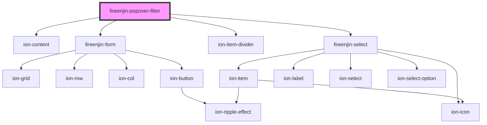

# fireenjin-popover-filter

<!-- Auto Generated Below -->

## Properties

| Property   | Attribute | Description | Type        | Default     |
| ---------- | --------- | ----------- | ----------- | ----------- |
| `controls` | --        |             | `Control[]` | `undefined` |
| `label`    | `label`   |             | `string`    | `undefined` |

## Dependencies

### Depends on

- ion-content
- [fireenjin-form](../form)
- ion-item-divider
- [fireenjin-select](../select)

### Graph

----------------------------------------------

*Built with [StencilJS](https://stenciljs.com/)*
