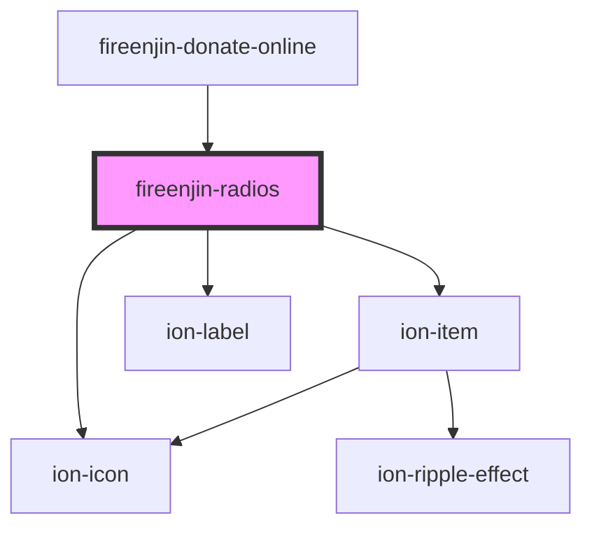

# fireenjin-radios

<!-- Auto Generated Below -->

## Properties

| Property   | Attribute  | Description | Type                          | Default     |
| ---------- | ---------- | ----------- | ----------------------------- | ----------- |
| `label`    | `label`    |             | `string`                      | `undefined` |
| `lines`    | `lines`    |             | `"full" \| "inset" \| "none"` | `"none"`    |
| `name`     | `name`     |             | `string`                      | `undefined` |
| `options`  | `options`  |             | `any`                         | `undefined` |
| `required` | `required` |             | `any`                         | `undefined` |
| `selected` | `selected` |             | `number`                      | `0`         |
| `value`    | `value`    |             | `any`                         | `undefined` |

## Events

| Event       | Description | Type               |
| ----------- | ----------- | ------------------ |
| `ionChange` |             | `CustomEvent<any>` |

## Dependencies

### Used by

- [fireenjin-donate-online](../donate-online)

### Depends on

- ion-item
- ion-label
- ion-icon

### Graph

---

_Built with [StencilJS](https://stenciljs.com/)_
