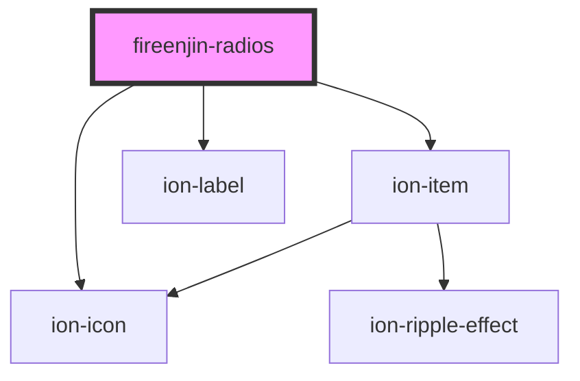

# fireenjin-radios

<!-- Auto Generated Below -->

## Properties

| Property        | Attribute        | Description | Type                                 | Default     |
| --------------- | ---------------- | ----------- | ------------------------------------ | ----------- |
| `label`         | `label`          |             | `string`                             | `undefined` |
| `labelPosition` | `label-position` |             | `"fixed" \| "floating" \| "stacked"` | `undefined` |
| `lines`         | `lines`          |             | `"full" \| "inset" \| "none"`        | `"none"`    |
| `name`          | `name`           |             | `string`                             | `undefined` |
| `options`       | `options`        |             | `any`                                | `undefined` |
| `required`      | `required`       |             | `any`                                | `undefined` |
| `selected`      | `selected`       |             | `number`                             | `0`         |
| `value`         | `value`          |             | `any`                                | `undefined` |

## Events

| Event       | Description | Type               |
| ----------- | ----------- | ------------------ |
| `ionChange` |             | `CustomEvent<any>` |

## Dependencies

### Depends on

- ion-item
- ion-label
- ion-icon

### Graph

----------------------------------------------

*Built with [StencilJS](https://stenciljs.com/)*
