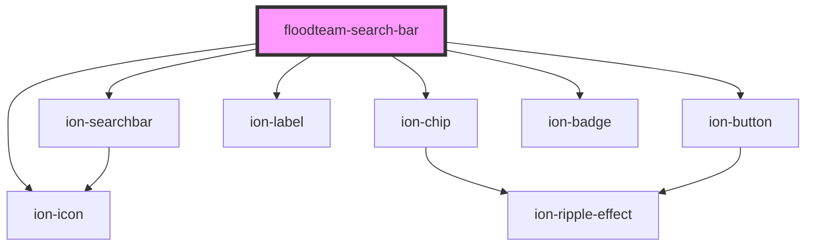

# floodteam-search-bar

<!-- Auto Generated Below -->

## Properties

| Property           | Attribute            | Description | Type                                                                                                                                       | Default     |
| ------------------ | -------------------- | ----------- | ------------------------------------------------------------------------------------------------------------------------------------------ | ----------- |
| `beforeGetResults` | `before-get-results` |             | `any`                                                                                                                                      | `undefined` |
| `disabled`         | `disabled`           |             | `boolean`                                                                                                                                  | `false`     |
| `displayMode`      | `display-mode`       |             | `"grid" \| "list"`                                                                                                                         | `"grid"`    |
| `filter`           | --                   |             | `{ label?: string; controls: filterControl[]; }`                                                                                           | `undefined` |
| `modeToggle`       | `mode-toggle`        |             | `boolean`                                                                                                                                  | `false`     |
| `paginationEl`     | `pagination-el`      |             | `any`                                                                                                                                      | `undefined` |
| `showFilter`       | `show-filter`        |             | `boolean`                                                                                                                                  | `true`      |
| `sort`             | --                   |             | `{ label?: string; value?: string; header?: string; subHeader?: string; message?: string; options: { label: string; value: string; }[]; }` | `undefined` |

## Events

| Event              | Description | Type               |
| ------------------ | ----------- | ------------------ |
| `fireenjinTrigger` |             | `CustomEvent<any>` |

## Methods

### `clearFilter(event: any, clearingControl: filterControl) => Promise<void>`

#### Returns

Type: `Promise<void>`

### `togglePaginationDisplay() => Promise<void>`

#### Returns

Type: `Promise<void>`

### `updateCurrentFilters() => Promise<void>`

#### Returns

Type: `Promise<void>`

## Dependencies

### Depends on

- ion-searchbar
- ion-chip
- ion-icon
- ion-label
- ion-button
- ion-badge

### Graph

----------------------------------------------

*Built with [StencilJS](https://stenciljs.com/)*
