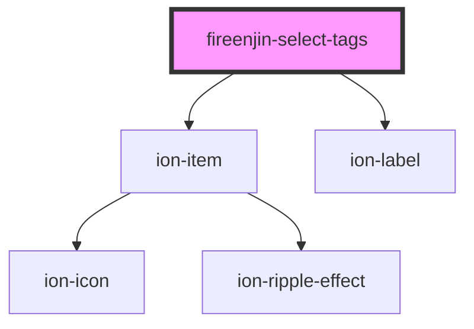

# fireenjin-select-tags

<!-- Auto Generated Below -->

## Properties

| Property      | Attribute     | Description | Type                               | Default         |
| ------------- | ------------- | ----------- | ---------------------------------- | --------------- |
| `disabled`    | `disabled`    |             | `boolean`                          | `false`         |
| `duplicates`  | `duplicates`  |             | `boolean`                          | `false`         |
| `label`       | `label`       |             | `any`                              | `undefined`     |
| `multiple`    | `multiple`    |             | `boolean`                          | `undefined`     |
| `name`        | `name`        |             | `string`                           | `"tags"`        |
| `options`     | --            |             | `{ label: string; value: any; }[]` | `[]`            |
| `placeholder` | `placeholder` |             | `string`                           | `"Select Tags"` |
| `required`    | `required`    |             | `boolean`                          | `undefined`     |
| `value`       | `value`       |             | `any`                              | `undefined`     |

## Events

| Event             | Description | Type                                                        |
| ----------------- | ----------- | ----------------------------------------------------------- |
| `fireenjinSelect` |             | `CustomEvent<{ event: any; options?: any; option?: any; }>` |

## Methods

### `getChoices() => Promise<any>`

#### Returns

Type: `Promise<any>`

### `setValue(value: any) => Promise<void>`

#### Returns

Type: `Promise<void>`

## Dependencies

### Depends on

- ion-item
- ion-label

### Graph

----------------------------------------------

*Built with [StencilJS](https://stenciljs.com/)*
