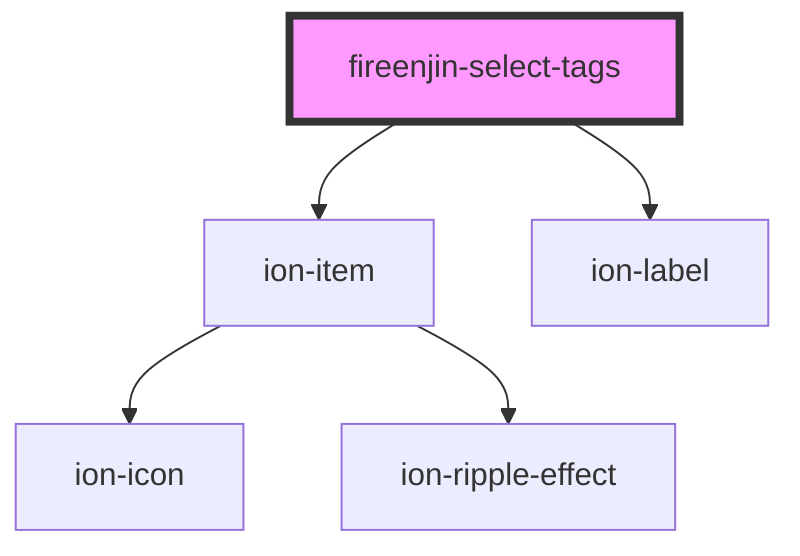

# fireenjin-select-tags

<!-- Auto Generated Below -->

## Properties

| Property         | Attribute         | Description | Type                                 | Default         |
| ---------------- | ----------------- | ----------- | ------------------------------------ | --------------- |
| `allowAdding`    | `allow-adding`    |             | `boolean`                            | `false`         |
| `dataPropsMap`   | `data-props-map`  |             | `any`                                | `undefined`     |
| `disableFetch`   | `disable-fetch`   |             | `boolean`                            | `false`         |
| `disabled`       | `disabled`        |             | `boolean`                            | `false`         |
| `duplicates`     | `duplicates`      |             | `boolean`                            | `false`         |
| `endpoint`       | `endpoint`        |             | `string`                             | `undefined`     |
| `fetchData`      | `fetch-data`      |             | `any`                                | `undefined`     |
| `label`          | `label`           |             | `any`                                | `undefined`     |
| `labelPosition`  | `label-position`  |             | `"fixed" \| "floating" \| "stacked"` | `undefined`     |
| `limit`          | `limit`           |             | `number`                             | `15`            |
| `lines`          | `lines`           |             | `"full" \| "inset" \| "none"`        | `undefined`     |
| `multiple`       | `multiple`        |             | `boolean`                            | `undefined`     |
| `name`           | `name`            |             | `string`                             | `"tags"`        |
| `options`        | --                |             | `{ label: string; value: any; }[]`   | `[]`            |
| `orderBy`        | `order-by`        |             | `string`                             | `undefined`     |
| `orderDirection` | `order-direction` |             | `string`                             | `undefined`     |
| `page`           | `page`            |             | `number`                             | `0`             |
| `placeholder`    | `placeholder`     |             | `string`                             | `"Select Tags"` |
| `query`          | `query`           |             | `string`                             | `undefined`     |
| `required`       | `required`        |             | `boolean`                            | `false`         |
| `results`        | --                |             | `any[]`                              | `[]`            |
| `resultsKey`     | `results-key`     |             | `string`                             | `undefined`     |
| `value`          | `value`           |             | `any`                                | `undefined`     |

## Events

| Event            | Description | Type                                                     |
| ---------------- | ----------- | -------------------------------------------------------- |
| `fireenjinFetch` |             | `CustomEvent<any>`                                       |
| `ionChange`      |             | `CustomEvent<{ event: any; name: string; value: any; }>` |

## Methods

### `addResults(results?: any[]) => Promise<void>`

#### Returns

Type: `Promise<void>`

### `clearParamData(key?: string) => Promise<{ query?: string; limit?: number; orderBy?: string; orderDirection?: "asc" | "desc"; whereEqual?: string; whereLessThan?: string; whereLessThanOrEqual?: string; whereGreaterThan?: string; whereGreaterThanOrEqual?: string; whereArrayContains?: string; whereArrayContainsAny?: string; whereIn?: string; next?: string; back?: string; }>`

#### Returns

Type: `Promise<{ query?: string; limit?: number; orderBy?: string; orderDirection?: "asc" | "desc"; whereEqual?: string; whereLessThan?: string; whereLessThanOrEqual?: string; whereGreaterThan?: string; whereGreaterThanOrEqual?: string; whereArrayContains?: string; whereArrayContainsAny?: string; whereIn?: string; next?: string; back?: string; }>`

### `clearResults() => Promise<void>`

#### Returns

Type: `Promise<void>`

### `getChoices() => Promise<any>`

#### Returns

Type: `Promise<any>`

### `getResults(options?: { page?: number; next?: boolean; limit?: number; paramData?: any; }) => Promise<void>`

#### Returns

Type: `Promise<void>`

### `setValue(value: any) => Promise<void>`

#### Returns

Type: `Promise<void>`

## Dependencies

### Depends on

- ion-item
- ion-label

### Graph

----------------------------------------------

*Built with [StencilJS](https://stenciljs.com/)*
