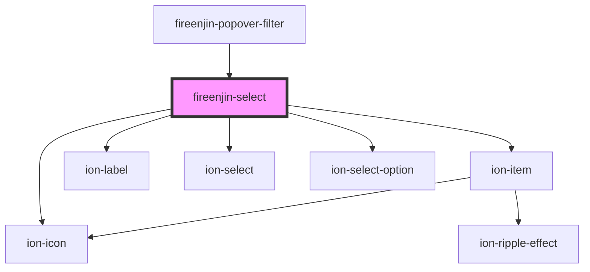

# fireenjin-select

<!-- Auto Generated Below -->

## Properties

| Property           | Attribute           | Description                                                                                                                                                                                                                                                                                                                                               | Type                                                                    | Default     |
| ------------------ | ------------------- | --------------------------------------------------------------------------------------------------------------------------------------------------------------------------------------------------------------------------------------------------------------------------------------------------------------------------------------------------------- | ----------------------------------------------------------------------- | ----------- |
| `cancelText`       | `cancel-text`       | The text to display on the cancel button.                                                                                                                                                                                                                                                                                                                 | `string`                                                                | `'Dismiss'` |
| `compareWith`      | `compare-with`      | A property name or function used to compare object values                                                                                                                                                                                                                                                                                                 | `((currentValue: any, compareValue: any) => boolean) \| string`         | `undefined` |
| `dataPropsMap`     | `data-props-map`    |                                                                                                                                                                                                                                                                                                                                                           | `any`                                                                   | `undefined` |
| `disabled`         | `disabled`          | If `true`, the user cannot interact with the select.                                                                                                                                                                                                                                                                                                      | `boolean`                                                               | `false`     |
| `endpoint`         | `endpoint`          |                                                                                                                                                                                                                                                                                                                                                           | `string`                                                                | `undefined` |
| `header`           | `header`            |                                                                                                                                                                                                                                                                                                                                                           | `string`                                                                | `undefined` |
| `icon`             | `icon`              |                                                                                                                                                                                                                                                                                                                                                           | `string`                                                                | `undefined` |
| `interface`        | `interface`         | The interface the select should use: `action-sheet`, `popover` or `alert`.                                                                                                                                                                                                                                                                                | `"action-sheet" \| "alert" \| "popover"`                                | `'alert'`   |
| `interfaceOptions` | `interface-options` | Any additional options that the `alert`, `action-sheet` or `popover` interface can take. See the [ion-alert docs](../alert), the [ion-action-sheet docs](../action-sheet) and the [ion-popover docs](../popover) for the create options for each interface.  Note: `interfaceOptions` will not override `inputs` or `buttons` with the `alert` interface. | `any`                                                                   | `{}`        |
| `label`            | `label`             |                                                                                                                                                                                                                                                                                                                                                           | `string`                                                                | `undefined` |
| `labelPosition`    | `label-position`    |                                                                                                                                                                                                                                                                                                                                                           | `"fixed" \| "floating" \| "stacked"`                                    | `undefined` |
| `limit`            | `limit`             |                                                                                                                                                                                                                                                                                                                                                           | `number`                                                                | `15`        |
| `lines`            | `lines`             |                                                                                                                                                                                                                                                                                                                                                           | `"full" \| "inset" \| "none"`                                           | `undefined` |
| `message`          | `message`           |                                                                                                                                                                                                                                                                                                                                                           | `string`                                                                | `undefined` |
| `multiple`         | `multiple`          | If `true`, the select can accept multiple values.                                                                                                                                                                                                                                                                                                         | `boolean`                                                               | `false`     |
| `name`             | `name`              | The name of the control, which is submitted with the form data.                                                                                                                                                                                                                                                                                           | `string`                                                                | `undefined` |
| `okText`           | `ok-text`           | The text to display on the ok button.                                                                                                                                                                                                                                                                                                                     | `string`                                                                | `'Okay'`    |
| `optionEl`         | --                  |                                                                                                                                                                                                                                                                                                                                                           | `(result: any) => HTMLIonSelectOptionElement`                           | `undefined` |
| `options`          | --                  |                                                                                                                                                                                                                                                                                                                                                           | `{ label?: string; value?: any; disabled?: boolean; payload?: any; }[]` | `[]`        |
| `orderBy`          | `order-by`          |                                                                                                                                                                                                                                                                                                                                                           | `string`                                                                | `undefined` |
| `params`           | `params`            |                                                                                                                                                                                                                                                                                                                                                           | `any`                                                                   | `undefined` |
| `placeholder`      | `placeholder`       | The text to display when the select is empty.                                                                                                                                                                                                                                                                                                             | `string`                                                                | `undefined` |
| `query`            | `query`             |                                                                                                                                                                                                                                                                                                                                                           | `string`                                                                | `undefined` |
| `resultsKey`       | `results-key`       |                                                                                                                                                                                                                                                                                                                                                           | `string`                                                                | `undefined` |
| `selectedText`     | `selected-text`     | The text to display instead of the selected option's value.                                                                                                                                                                                                                                                                                               | `string`                                                                | `undefined` |
| `subHeader`        | `sub-header`        |                                                                                                                                                                                                                                                                                                                                                           | `string`                                                                | `undefined` |
| `value`            | `value`             | the value of the select.                                                                                                                                                                                                                                                                                                                                  | `any`                                                                   | `undefined` |

## Events

| Event            | Description | Type               |
| ---------------- | ----------- | ------------------ |
| `fireenjinFetch` |             | `CustomEvent<any>` |

## Dependencies

### Used by

 - [fireenjin-popover-filter](../popover-filter)

### Depends on

- ion-item
- ion-icon
- ion-label
- ion-select
- ion-select-option

### Graph

----------------------------------------------

*Built with [StencilJS](https://stenciljs.com/)*
