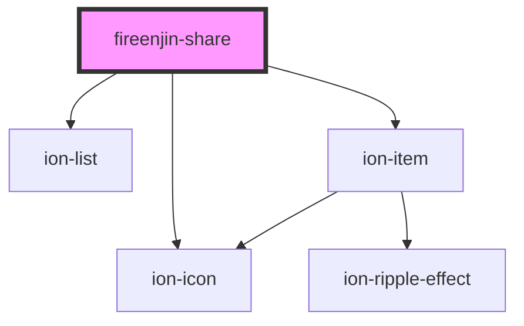

# fireenjin-share

<!-- Auto Generated Below -->

## Properties

| Property        | Attribute         | Description | Type                          | Default     |
| --------------- | ----------------- | ----------- | ----------------------------- | ----------- |
| `facebookAppId` | `facebook-app-id` |             | `string`                      | `undefined` |
| `lines`         | `lines`           |             | `"full" \| "inset" \| "none"` | `undefined` |
| `subject`       | `subject`         |             | `string`                      | `undefined` |
| `text`          | `text`            |             | `string`                      | `undefined` |
| `url`           | `url`             |             | `string`                      | `undefined` |

## Events

| Event                 | Description | Type               |
| --------------------- | ----------- | ------------------ |
| `fireenjinShareClose` |             | `CustomEvent<any>` |

## Dependencies

### Depends on

- ion-list
- ion-item
- ion-icon

### Graph

----------------------------------------------

*Built with [StencilJS](https://stenciljs.com/)*
