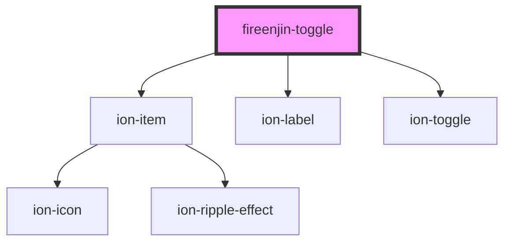

# fireenjin-toggle

<!-- Auto Generated Below -->

## Properties

| Property        | Attribute        | Description                                          | Type                                 | Default     |
| --------------- | ---------------- | ---------------------------------------------------- | ------------------------------------ | ----------- |
| `color`         | `color`          |                                                      | `string`                             | `undefined` |
| `disabled`      | `disabled`       | If `true`, the user cannot interact with the select. | `boolean`                            | `false`     |
| `label`         | `label`          |                                                      | `string`                             | `undefined` |
| `labelPosition` | `label-position` |                                                      | `"fixed" \| "floating" \| "stacked"` | `undefined` |
| `lines`         | `lines`          |                                                      | `"full" \| "inset" \| "none"`        | `undefined` |
| `name`          | `name`           |                                                      | `string`                             | `undefined` |
| `value`         | `value`          |                                                      | `boolean`                            | `undefined` |

## Dependencies

### Depends on

- ion-item
- ion-label
- ion-toggle

### Graph

----------------------------------------------

*Built with [StencilJS](https://stenciljs.com/)*
